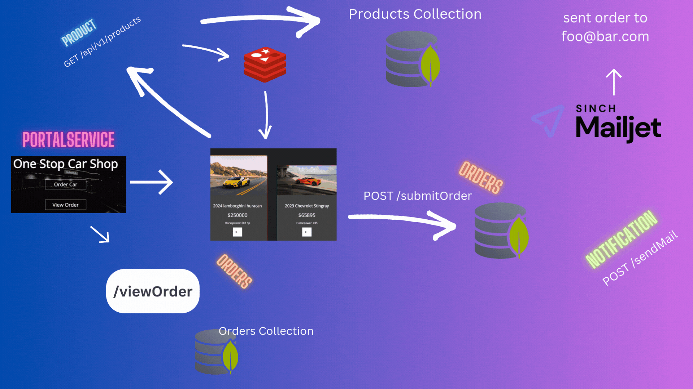

# Auto Shop
Auto Shop is made up of 4 individual microservices written in python using the flask framework: Attached below is the architectural breakdown. 



- PortalService: The frontend of application storefront allowing you to view order or purchase items
- ProductManagement: Flask API communicating with MongoDB Atlas to fetch all and individual products.
- OrderManagement: Flask API communicating with MongoDB Atlas to store purchased orders and generate orderId upon purchase
- NotificationGateway: Flask API built using Mailjet to send email when purchase is made

## How do I run the Autoshop?
### Prerequisites:
1. Create Free MongoDB Atlas Account: https://www.mongodb.com/cloud/atlas/register
2. Create MongoDB Cluster: https://www.mongodb.com/docs/guides/atlas/cluster/
3. Create Free MailJet Account: https://app.mailjet.com/signup?lang=en_US
4. Python 3 Installed: https://www.python.org/downloads/
5. Fork repository and clone onto your machine

### What next?
1. Create a virtualenv in the root of the project then activate it
```
python3 -m venv venv
source venv/bin/activate
```
2. In order to successfully run each microservice, you will need to open 4 terminal windows
3. cd into each service and run the following. This will install the required dependencies each service needs into your virtual environment
```
pip install -r requirements.txt
```
4. run each service with the following
```
python3 app.py
```
5. Open PortalService in https://127.0.0.1:5001

## Running in Kubernetes:
The below will create the namespace **app** with the deployments and services needed to run the application
```
$ cd kubernetes/
$ kubectl apply -f autoshop-deployment.yaml
```

To then view the application in the browser run
```
$ kubectl port-forward svc/portal 5001:5001 -n app
```

## Running locally with python:
you will need to cd into each service and run
```
$ opentelemetry-instrument python3 app.py
```

## Running Docker Compose:
To run in docker reference the following docker-compose.yaml by running
```
$ docker-compose up
```
